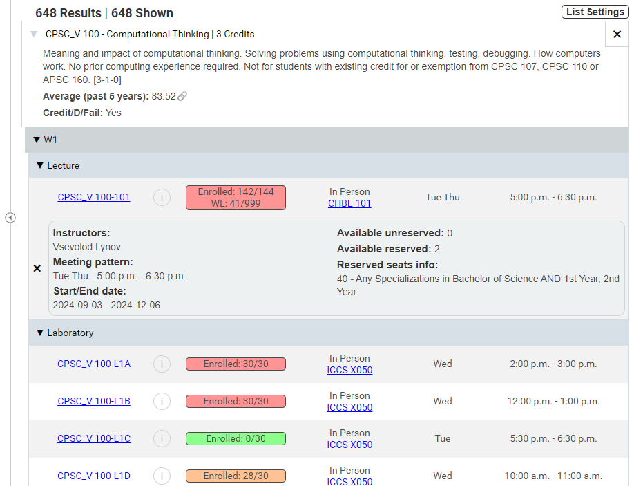

### Current repository version: 1.2.5

### Enhances Workday's messy course search list by compacting and categorizing courses, as well as displaying course descriptions, averages, instructors, and more through an intuitive layout on the same page.

## After:

## Before:

# Installation on Chrome
- ### [Chrome web store](https://chromewebstore.google.com/detail/better-workday-courselist/ldjigmjmlemmimiimckddfmkpgppkddh)

### Manual installation (note: may include unfinished features and unexpected behaviour):
1. Download the code as a ZIP file
2. Unzip the file
3. Go to chrome://extensions/ and turn on developer mode on the top right hand corner
4. Click `Load unpacked` on the top left hand corner
5. Select the unzipped file from before

# Installation on Firefox
1. Download `Better UBC Workday Courselist Firefox.zip`
2. Unzip the file
3. Go to about:debugging then choose `This Firefox` from the menu on the left
4. Click on `Load Temporary Add-on…`
5. Navigate to the unzipped folder and select `manifest.json`

(credit to unionpie for installation instructions)

# Note
- Workday only renders 50 sections at once, and the extension can only see the sections Workday has rendered. If the table is incomplete, please scroll to the bottom of the page to force Workday to render more sections.
- Many multi-term courses are not displayed correctly since Workday does not properly indicate which courses span multiple terms in its original layout. To confirm the length of a course, please press the (i) button for any of its sections and verify their start/end dates.
- Some courses are placed under the "Unspecified" term. This is a result of Workday not providing start/end dates properly in its original layout. Please check the start/end dates of such courses by pressing the (i) button for any of its sections.
