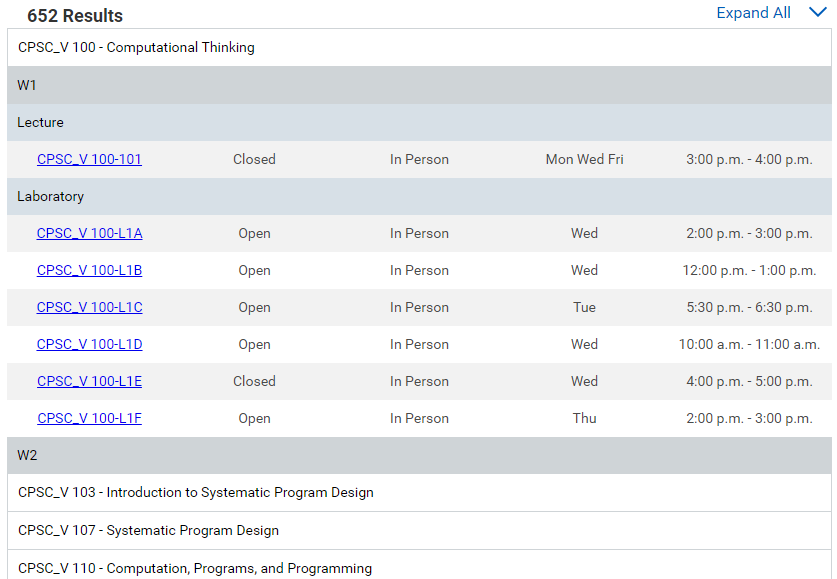

### Reformats UBC Workday's course search list to one similar to UBC's old SSC layout.

## After:

## Before:

# Installation
- [Chrome web store](https://chromewebstore.google.com/detail/better-workday-courselist/ldjigmjmlemmimiimckddfmkpgppkddh)
- [Firefox](https://addons.mozilla.org/en-US/firefox/addon/better-ubc-workday-courselist/)

# Known issues
- Workday only renders 50 sections at once, and the extension can only see the sections Workday has rendered. If the table is incomplete, the user must scroll to the bottom of the page to force workday to fetch and render more sections.
- Multi-term courses are not displayed correctly since Workday does not properly indicate which courses span multiple terms without having to view course details.
- Some courses are placed under the "Unspecified" term. This is a result of Workday not providing course details in its original layout.