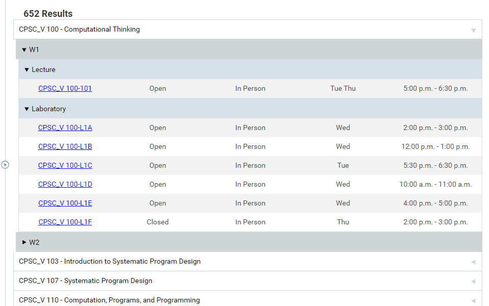

## July 6 update:
The webstore version (1.0.1) is broken since Workday updated their website. 1.0.2, which fixes this issue, is currently being approved by the Chrome Web Store. Chrome's manual installation version and Firefox's installation zip file currently work.

### Reformats UBC Workday's course search list to one similar to UBC's old SSC layout.

## After:

## Before:

# Installation on Chrome
- ### [Chrome web store](https://chromewebstore.google.com/detail/better-workday-courselist/ldjigmjmlemmimiimckddfmkpgppkddh)

### Manual installation (note: may include unfinished features and unexpected behaviour):
1. Download the code as a ZIP file
2. Unzip the file
3. Go to chrome://extensions/ and turn on developer mode on the top right hand corner
4. Click `Load unpacked` on the top left hand corner
5. Select the unzipped file from before

# Installation on Firefox
1. Download `Better UBC Workday Courselist Firefox.zip`
2. Unzip the file
3. Go to about:debugging then choose `This Firefox` from the menu on the left
4. Click on `Load Temporary Add-on…`
5. Navigate to the unzipped folder and select `manifest.json`

(credit to unionpie for installation instructions)

# Known issues
- Workday only renders 50 sections at once, and the extension can only see the sections Workday has rendered. If the table is incomplete, the user must scroll to the bottom of the page to force workday to fetch and render more sections.
- Multi-term courses are not displayed correctly since Workday does not properly indicate which courses span multiple terms without having to view course details.
- Some courses are placed under the "Unspecified" term. This is a result of Workday not providing course details in its original layout.